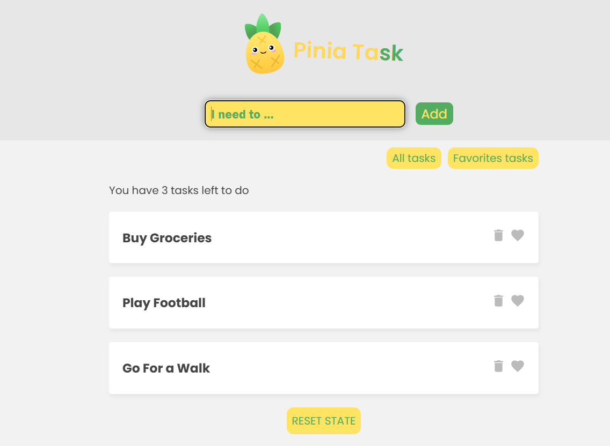
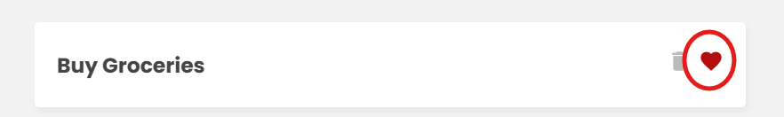
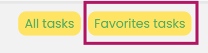

# Todo Tasks With Pinia in Project Management and Vue js in frontend


### You can Manage your tasks with This app




### And you can put a Piriority to a task by Clicking Fav Icon



### And it will be Showen in Fav List




## You can Donwload The zip file and run ` json-server` to db.json file in data folder

```
json-server "./data/db.json"
```
